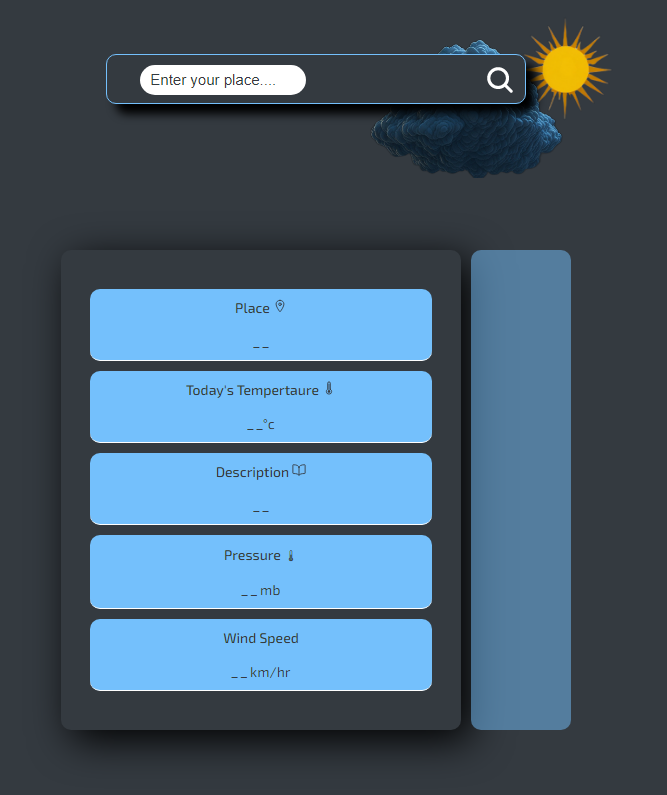
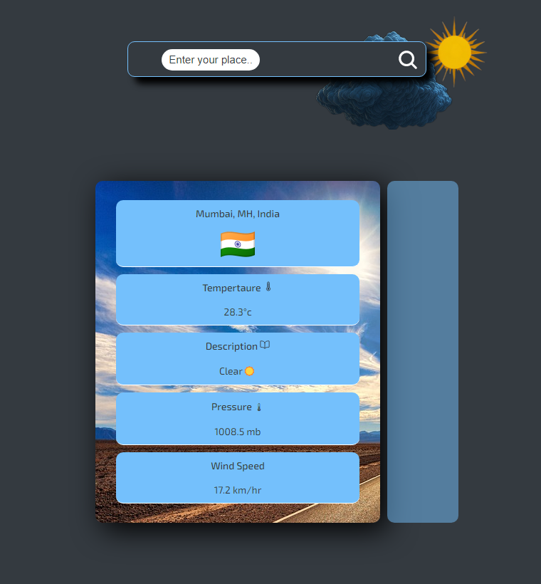

# Weather App

This is a simple demo weather app that allows users to search for weather information for any location in the world. The app uses the Visual Crossing Weather API to retrieve real-time weather data and displays it in an engaging and interactive way.

##link

https://rahulmehra-1993.github.io/WeatherApp/

## Features

- Real-time weather data for any location in the world
- Customizable background images and animations based on the weather conditions
- Displaying the location country by fetch open source flag cdn

## Usage

To use the app, simply enter the name of a city or town in the search bar with a key (for restricted api call counts) and click the "Search" button. The app will retrieve the current weather data for that location and display it on the screen.

## Screenshots

 

## Animations

The app includes several animations that are triggered by different weather conditions:

- On reload and first time visit you can see the sun and cloud animation below the serach bar in laptop,dekstop or any other device having screen size greater than smart phone screen sizes
- animation on the second screen to display the next day weather information
- animation on fetching data from the api

## Credits

This app was created by Me just for fun and learning purpose.
